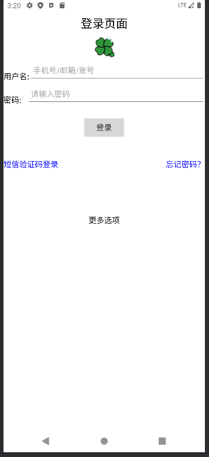

# java代码
````
package com.clover.applearnjava;

import android.os.Bundle;
import android.util.Log;
import android.widget.Button;
import android.widget.EditText;
import android.widget.Toast;
import androidx.activity.EdgeToEdge;
import androidx.appcompat.app.AppCompatActivity;
import androidx.core.graphics.Insets;
import androidx.core.view.ViewCompat;
import androidx.core.view.WindowInsetsCompat;

public class MainActivity extends AppCompatActivity {

    @Override
    protected void onCreate(Bundle savedInstanceState) {
        super.onCreate(savedInstanceState);
        EdgeToEdge.enable(this);
        setContentView(R.layout.activity_main);

        // 设置 WindowInsets 监听器
        ViewCompat.setOnApplyWindowInsetsListener(findViewById(R.id.main), (v, insets) -> {
            Insets systemBars = insets.getInsets(WindowInsetsCompat.Type.systemBars());
            v.setPadding(systemBars.left, systemBars.top, systemBars.right, systemBars.bottom);
            return insets;
        });

        // 获取用户名和密码输入框
        EditText usernameInput = findViewById(R.id.usernameInput);
        EditText passwordInput = findViewById(R.id.passwordInput);

        // 获取登录按钮
        Button loginButton = findViewById(R.id.loginButton);
        loginButton.setOnClickListener(v -> {
            // 获取用户输入的用户名和密码
            String username = usernameInput.getText().toString().trim();
            String password = passwordInput.getText().toString().trim();

            // 打印调试信息
            Log.d("MainActivity", "Username: " + username);
            Log.d("MainActivity", "Password: " + password);

            // 检查用户名和密码是否符合要求
            if ("clover".equals(username) && "123456".equals(password)) {
                Log.d("MainActivity", "Showing Toast for successful login");
                Toast.makeText(MainActivity.this, "登录成功！",Toast.LENGTH_LONG).show();
            } else {
                Log.d("MainActivity", "Showing Toast for failed login");
                Toast.makeText(MainActivity.this, "用户名或密码错误！", Toast.LENGTH_LONG).show();
            }
        });
    }
}
````

# xml代码
````
<?xml version="1.0" encoding="utf-8"?>
<LinearLayout
        xmlns:android="http://schemas.android.com/apk/res/android"
        xmlns:tools="http://schemas.android.com/tools"
        android:id="@+id/main"
        android:layout_width="match_parent"
        android:layout_height="match_parent"
        android:orientation="vertical"
        android:padding="16dp"
        android:background="@color/white"
        tools:context=".MainActivity"
        >

    <TextView
            android:id="@+id/title"
            android:layout_width="match_parent"
            android:layout_height="wrap_content"
            android:text="登录页面"
            android:textSize="24sp"
            android:textColor="@color/black"
            android:gravity="center"
            android:padding="8dp"
            />

    <LinearLayout
            android:layout_width="match_parent"
            android:layout_height="442dp"
            android:orientation="vertical"
            android:layout_gravity="center_vertical"
            >

        <!-- 图片 -->
        <ImageView
                android:id="@+id/imageView"
                android:layout_width="wrap_content"
                android:layout_height="wrap_content"
                android:src="@drawable/clover"
                android:layout_gravity="center_horizontal"
                />

        <!-- 用户名 -->
        <LinearLayout
                android:layout_width="match_parent"
                android:layout_height="wrap_content"
                android:orientation="horizontal"
                android:gravity="center_vertical"
                >

            <TextView
                    android:id="@+id/usernameLabel"
                    android:layout_width="wrap_content"
                    android:layout_height="wrap_content"
                    android:text="用户名:"
                    android:textSize="16sp"
                    android:textColor="@color/black"
                    android:layout_marginTop="12dp"
                    />

            <EditText
                    android:id="@+id/usernameInput"
                    android:layout_width="0dp"
                    android:layout_height="48dp"
                    android:layout_weight="1"
                    android:hint="手机号/邮箱/账号"
                    android:inputType="text"
                    android:padding="8dp"
                    android:textColor="@color/black"
                    android:textSize="16sp"
                    />
        </LinearLayout>

        <!-- 密码 -->
        <LinearLayout
                android:layout_width="match_parent"
                android:layout_height="wrap_content"
                android:orientation="horizontal"
                android:gravity="center_vertical"
                >

            <TextView
                    android:id="@+id/passwordLabel"
                    android:layout_width="wrap_content"
                    android:layout_height="wrap_content"
                    android:text="密码:   "
                    android:textSize="16sp"
                    android:textColor="@color/black"
                    android:layout_marginTop="12dp"
                    />

            <EditText
                    android:id="@+id/passwordInput"
                    android:layout_width="0dp"
                    android:layout_height="48dp"
                    android:layout_weight="1"
                    android:hint="@string/passwordHint"
                    android:inputType="textPassword"
                    android:padding="8dp"
                    android:textColor="@color/black"
                    android:textSize="16sp"
                    />
        </LinearLayout>

        <!-- 登录按钮 -->
        <Button
                android:id="@+id/loginButton"
                android:layout_width="wrap_content"
                android:layout_height="wrap_content"
                android:text="登录"
                android:layout_gravity="center_horizontal"
                android:layout_marginTop="20dp"
                android:padding="8dp"
                android:textSize="16sp"
                />

        <LinearLayout
                android:layout_width="match_parent"
                android:layout_height="wrap_content"
                android:orientation="horizontal"
                android:gravity="center_vertical"
                android:layout_marginTop="40dp"
                >

            <TextView
                    android:id="@+id/Vc"
                    android:layout_width="0dp"
                    android:layout_height="wrap_content"
                    android:layout_weight="1"
                    android:text="短信验证码登录"
                    android:textSize="16sp"
                    android:textColor="#0000FF"
                    android:gravity="start"
                    />

            <TextView
                    android:id="@+id/forgotPassword"
                    android:layout_width="0dp"
                    android:layout_height="wrap_content"
                    android:layout_weight="1"
                    android:text="忘记密码？"
                    android:textSize="16sp"
                    android:textColor="#0000FF"
                    android:gravity="end"
                    />
        </LinearLayout>

        <!-- 更多选项 -->
        <TextView
                android:id="@+id/moreInfo"
                android:layout_width="wrap_content"
                android:layout_height="wrap_content"
                android:text="更多选项"
                android:textSize="16sp"
                android:textColor="@color/black"
                android:layout_gravity="center_horizontal"
                android:layout_marginTop="92dp"
                />
    </LinearLayout>
</LinearLayout>
````

# 界面展示
