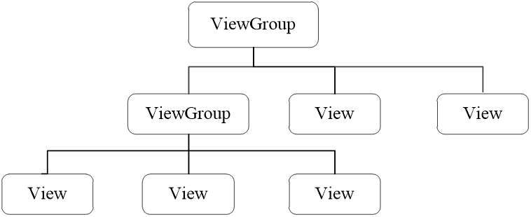

# ui开发

## 概述
### 在Android应用中，UI（User Interface）界面是人与手机之间数据传递、交互信息的重要媒介和对话接口。
### Android程序开发最重要的一个环节就是界面处理，界面的美观度直接影响用户的第一印象，因此，开发一个整齐、美观的界面是至关重要的。
### Android应用的界面是由View和ViewGroup对象构建而成的。


## 布局文件的创建
### Android中的布局如下：
### LinearLayout(线性布局)
#### 线性布局是Android中较为常用的布局方式，它使用<LinearLayout>标签表示。
#### 线性布局有两种方式指定控件位置，一种是水平方向，一种是竖直方向
### RelativeLayout(相对布局)
#### 相对布局通常有两种形式，一种是相对于容器而言的，一种是相对于控件而言的。
### TableLayout(表格布局)
#### 表格布局就是让控件以表格的形式来排列组件的，只要将组件或信息放在单元格中，控件就可以整齐地排列。
#### 在TableLayout中，行数由TableRow对象控制的，即布局中有多少TableRow对象，就有多少行。
### GridLayout(网格布局)
#### 网格布局是Android4.0新增的布局，它实现了控件的交错显示，能够避免因布局嵌套对设备性能的影响，更利于自由布局的开发。
#### 网格布局用一组无限细的直线将绘图区域分成行、列和单元，并指定控件的显示区域和控件在该区域的显示方式。
#### 由于GridLayout是Android4.0之后有的新功能，如果要在项目中使用这种布局，需要把SDK的最低版本指定为Android4.0（API14）以上。
#### AndroidManifest.xml中，配置SDK兼容的最低版本和最高版本示例代码如下：
````
<uses-sdk
android:minSdkVersion="14"
android:targetSdkVersion="17" />
````
### FrameLayout(帧布局)
#### 帧布局为每个加入其中的控件创建一个空白区域（称为一帧，每个控件占据一帧）。
#### 采用帧布局设计界面时，只能在屏幕左上角显示一个控件，如果添加多个控件，这些控件会按照顺序在屏幕的左上角重叠显示，且会透明显示之前控件的文本。
### AbsoluteLayout(绝对布局)(分辨率问题不推荐)
#### 绝对布局需要通过指定x、y坐标来控制每一个控件的位置，放入该布局的组件需要通过android:layout_x和android:layout_y两个属性指定其准确的坐标值，并显示在屏幕上。

## 样式和主题
### 自定义样式和主题的步骤如下：
#### 1）在res/values 目录创建样式文件style.xml，添加resources根节点。
#### 2）在resources节点中添加一个style节点，并在该节点中为样式或主题定义一个名称。
#### 3）在style节点中声明一个或多个item，每个item节点需要定义一个属性名，并在元素内部设置这个属性的值。 

## Toast的使用
### Toast会显示一个小消息告诉用户一些必要信息，该消息在短时间内自动消失，不会干扰用户操作。
### Toast组件有两个方法makeText()和show()，其中makeText()方法用于设置需要显示的字符串，show()方法显示消息框。
````
Toast toast = Toast.makeText(Context,Text,Time);
toast.show();
````
### 简写形式如下：
````
Toast.makeText(context,"这是弹出消息！",0).show();
````

### 事件
#### 虽然按钮控件能够在XML文件中通过onClick属性指定点击方法，但是方法的名称可以随便叫，既能叫 doClick也能叫doTouch，甚至叫它doA或doB都没问题，这样很不利于规范化代码，倘若以后换了别人 接手，就不晓得doA或doB是干什么用的。因此在实际开发中，不推荐使用Button标签的onClick属性， 而是在代码中给按钮对象注册点击监听器。
#### 尽管按钮控件生来就是给人点击的，可是某些情况希望暂时禁止点击操作，譬如用户在注册的时候，有 的网站要求用户必须同意指定条款，而且至少浏览10秒之后才能点击注册按钮。那么在10秒之前，注册 按钮应当置灰且不能点击，等过了10秒之后，注册按钮才恢复正常。
#### 在这样的业务场景中，按钮先后拥 有两种状态，即不可用状态与可用状态，它们在外观和功能上的区别如下：
#### 不可用按钮：按钮不允许点击，即使点击也没反应，同时按钮文字为灰色。
#### 可用按钮：按钮允许点击，点击按钮会触发点击事件，同时按钮文字为正常的黑色

## 图像按钮(ImageButton)
### 常见的按钮控件Button其实是文本按钮，因为按钮上面只能显示文字，不能显示图片，ImageButton才 是显示图片的图像按钮。虽然ImageButton号称图像按钮，但它并非继承Button，而是继承了 ImageView，所以凡是ImageView拥有的属性和方法，ImageButton统统拿了过来，区别在于 ImageButton有个按钮背景。 尽管ImageButton源自ImageView，但它毕竟是个按钮呀，按钮家族常用的点击事件和长按事件， ImageButton全都没落下。不过ImageButton和Button之间除了名称不同，还有下列差异：
### Button既可显示文本也可显示图片（通过setBackgroundResource方法设置背景图片），而 ImageButton只能显示图片不能显示文本。
### ImageButton上的图像可按比例缩放，而Button通过背景设置的图像会拉伸变形，因为背景图采取 fitXY方式，无法按比例缩放。
### Button只能靠背景显示一张图片，而ImageButton可分别在前景和背景显示图片，从而实现两张图 片叠加的效果。

## 同时展示文本和图片
### 现在有了Button可在按钮上显示文字，又有ImageButton可在按钮上显示图像，照理说绝大多数场合都 够用了。然而现实项目中的需求往往捉摸不定，例如客户要求在按钮文字的左边加一个图标，这样按钮 内部既有文字又有图片，乍看之下Button和ImageButton都没法直接使用。
### 若用LinearLayout对 ImageView和TextView组合布局，虽然可行，XML文件却变得冗长许多。 其实有个既简单又灵活的办法，要想在文字周围放置图片，使用按钮控件Button就能实现。原来Button 悄悄提供了几个与图标有关的属性，通过这些属性即可指定文字旁边的图标，以下是有关的图标属性说明。
````
drawableTop：指定文字上方的图片。
drawableBottom：指定文字下方的图片。
drawableLeft：指定文字左边的图片。
drawableRight：指定文字右边的图片。
drawablePadding：指定图片与文字的间距。
````